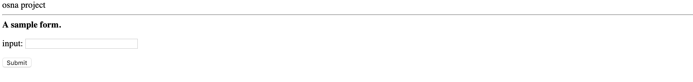

# Week 1


**Table of Contents**
- [Day 1](#day-1)
  + [Lecture](#lecture)
  + [Lab](#lab)
- [Day 2](#day-2)
  + [Lecture](#lecture-1)
  + [Lab](#lab-1)
- [Day 3](#day-3)
  + [Lecture](#lecture-2)
  + [Lab](#lab-2)

<br>

The goals of this week are to:

- familiarize yourself with many of the tools we will be using throughout this project
- ...

<br>

## Day 1

Today we will ...

### Lecture

#### Getting Started with your Github Repository.

You should have been assigned a project repository for your work. In the examples below, we'll assume the repository is called <https://github.com/tapilab/elevate-osna-team1>. This is where all your code will live. 

Your repository has been setup with a lot of starter code so you can get started more easily. To use it, do the following:

1. Make sure you've completed all the course **Prerequisites** listed on the [README](https://github.com/tapilab/elevate-osna-starter) in `elevate-osna-starter`/
2. Clone your repo:  `git clone https://github.com/tapilab/elevate-osna-team1`
3. Start a [virtual environment](https://virtualenv.pypa.io/en/stable/).
  - First, make sure you have virtual env installed. `pip install virtualenv`
  - Next, outside of the team repository, create a new virtual environment folder by `virtualenv osna-virtual`. 
  - Activate your virtual environment by `source osna-virtual/bin/activate`
  - Now, when you install python software, it will be saved in your `osna-virtual` folder, so it won't conflict with the rest of your system.
4. Install your project code by
```
cd elevate-osna-team1   # enter your project repository folder
python setup.py develop # install the code. 
```

This may take a while, as all dependencies listed in the `requirements.txt` file will also be installed. (Windows users: if you're having troubles, try reading [this](http://timmyreilly.azurewebsites.net/python-flask-windows-development-environment-setup/)).

5. If everything worked properly, you should now be able to run your project's command-line tool:  
```osna --help
Usage: osna [OPTIONS] COMMAND [ARGS]...

  Console script for osna.

Options:
  --help  Show this message and exit.

Commands:
  web
```


#### Setting up Twitter tokens
In order to use the Twitter API, you will need to create an app on their site, then generate security tokens which are required to communicate with the API.

1. Create an account on [twitter.com](http://twitter.com).
2. Generate authentication tokens by following the instructions [here](https://developer.twitter.com/en/docs/basics/authentication/guides/access-tokens.html).
3. Add your tokens to the [credentials.json](https://raw.githubusercontent.com/tapilab/elevate-osna-starter/master/credentials.json) file. (API Key == Consumer Key)
4. Copy `credentials.json` to your home directory `~/.osna/credentials.json` (on windows, this is `C:\Users\<username>`.)


#### Flask Web UI

Your tool currently has one command called `web`. This launches a simple web server which we will use to make a demo of your project. You can launch it with:  
`osna web`  
which should produce output like:
```
See Click documentation at http://click.pocoo.org/
 * Serving Flask app "osna.app" (lazy loading)
 * Environment: production
   WARNING: This is a development server. Do not use it in a production deployment.
   Use a production WSGI server instead.
 * Debug mode: on
 * Running on http://0.0.0.0:5000/ (Press CTRL+C to quit)
 * Restarting with stat
See Click documentation at http://click.pocoo.org/
 * Debugger is active!
 * Debugger PIN: 240-934-736
```

If you open your web browser and go to `http://0.0.0.0:5000/` you should see something like:




### Lab

The goal's for this lab are to:

1. Continue all the setup tasks from the lecture, with help from the TA.
2. Add the names of your team members to your web site on the line that says "osna project"
3. Modify `osna/app/static/main.css` to make all labels of the form blue (e.g., the word "input" on the form should become blue).

**Tips:**: 
- Some web browsers will cache the page, which will sometimes make it hard to see the updates you make. You may have to force a refresh that ignores the cache (e.g. see [here for Chrome](https://superuser.com/questions/89809/how-to-force-refresh-without-cache-in-google-chrome)).


<br>

## Day 2

Today we will ...

### Lecture

- First, each team will present their work from the lab on Day 1.

#### Topic 1

### Lab

#### Topic 1


<br>

## Day 3

Today we will ...

### Lecture

#### Topic 1

### Lab

#### Topic 1


